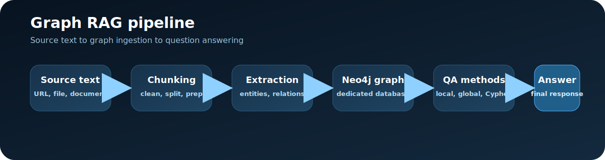
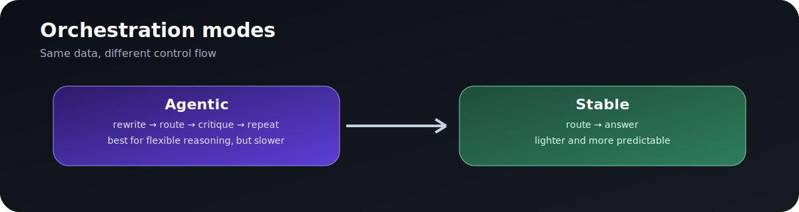

# Graph RAG Orchestration

Graph RAG Orchestration is a compact tutorial repository for building and querying a Neo4j-backed graph RAG system with OpenAI models.
It covers the full workflow from source text to graph construction to question answering, with a notebook and three focused demos that mirror the major stages.

## Pipeline Overview



The workflow is:

1. Load or download source text.
2. Clean and chunk the text.
3. Extract entities and relationships.
4. Store the graph in a dedicated Neo4j database.
5. Build summaries, embeddings, and retrieval indexes.
6. Answer questions through graph-aware methods.
7. Route questions with orchestration.

## Practical Challenges

This tutorial is built to show the full pipeline, but real deployments also need to handle practical constraints:

- Latency: extraction, Cypher generation, and orchestration can each trigger multiple model calls, so end-to-end runs may take time.
- Text quality: source documents are not always clean or well-structured, which affects chunking and downstream extraction quality.
- Preprocessing: chunk size, overlap, cleaning rules, and document normalization all influence retrieval and graph quality.
- Database hygiene: repeated runs should target a clean Neo4j database to avoid duplication and stale state.

## Production Considerations

When moving beyond a demo, additional engineering work is usually needed for:

- Cost control: model calls, retries, and large context windows can add up quickly.
- Reliability: routing, Cypher repair, and extraction may need stricter guardrails and fallbacks.
- Evaluation: you will want a repeatable test set to measure routing accuracy and answer quality.
- Observability: logging, tracing, and run metadata are important for debugging failures and regressions.
- Schema drift: the graph schema, prompts, and query templates should be versioned together.
- Security: secrets, database credentials, and access control should be managed outside the repo.
- Scale: throughput, batching, and concurrency become important once documents or users grow.

## Included Demos

- `entity_extraction_demo.py`: entity and relationship extraction from source text
- `cypher_generation_demo.py`: schema-aware Text-to-Cypher generation
- `graph_orchestration_demo.py`: orchestration logic that selects the best question-answering method
- `integrated_graph_rag_demo.ipynb`: the end-to-end tutorial notebook
- `extraction_tools.py`, `cypher_generation.py`, `graph_tools.py`, `neo4j_schema.py`, `runtime.py`: shared support modules

## Orchestration Modes



The orchestration layer provides two modes:

- `agentic`: the original multi-step loop with question rewriting, routing, critique, and synthesis.
- `stable`: a lighter mode that keeps the same routing path but skips the extra rewrite/critique loop.

Both modes use the same graph-backed data and the same base methods. The difference is control flow, not capability.

## Question-Answering Methods

The tutorial compares these methods:

- `entity_info_by_name` for a single named entity
- `local_search` for local evidence in chunks and summaries
- `global_retriever` for higher-level community synthesis
- `Text2Cypher` for structured graph queries
- `orchestration_main` for automatic routing across the available methods

## Requirements

Install the Python dependencies listed in `requirements.txt`.

You also need:

- Neo4j running locally or remotely
- OpenAI API access
- the Neo4j credentials configured through environment variables

## Configuration

Set these environment variables before running the demos:

- `OPENAI_API_KEY`
- `NEO4J_URI`
- `NEO4J_USERNAME`
- `NEO4J_PASSWORD`

## Running the Demos

Run the individual demos directly:

```bash
python entity_extraction_demo.py
python cypher_generation_demo.py
python graph_orchestration_demo.py
```

Open `integrated_graph_rag_demo.ipynb` in Jupyter to follow the complete tutorial step by step.

## Repository Layout

- `integrated_graph_rag_demo.ipynb`: full tutorial notebook
- `entity_extraction_demo.py`: extraction demo
- `cypher_generation_demo.py`: Cypher demo
- `graph_orchestration_demo.py`: orchestration demo
- `sample_data/`: bundled example text
- `assets/`: diagrams used in the README

## Notes

This repository is intended as a public tutorial bundle. The code is organized so readers can follow the full workflow from source text to graph ingestion to question answering without jumping between unrelated notebooks.
